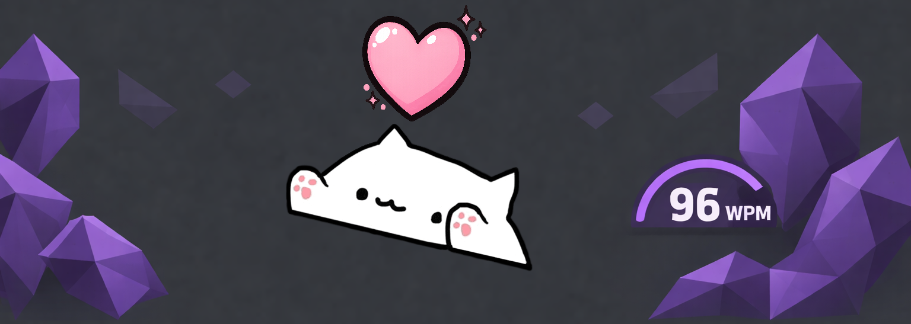

# Typing Cat

A cozy typing cat for Obsidian that keeps you company and tracks your typing speed.



## Features

- **Cozy Companion**: A cute cat overlay that types along with you in real-time.
- **Speed Tracking**: Monitors your typing speed with support for WPM (Words Per Minute), CPM (Characters Per Minute), and CPS (Characters Per Second).
- **Visual Feedback**: The cat "sweats" during intense typing sessions and shows a heart when clicked.
- **Highly Customizable**:
  - Adjust position (left and bottom percentages)
  - Change size and opacity
  - Mirror the cat's orientation
  - Toggle speed display and choose your preferred metric
- **Desktop Ready**: Designed to sit comfortably on your screen without interfering with your workflow.

## Manual Installation

1. Download `main.js`, `manifest.json`, and `styles.css` from the latest release.
2. Create a folder named `typing-cat` in your vault's plugins directory: `<Vault>/.obsidian/plugins/typing-cat/`.
3. Copy the downloaded files into that folder.
4. Reload Obsidian and enable **Typing Cat** in Settings → Community plugins.

## Usage

Once enabled, the Typing Cat will appear as an overlay on your Obsidian window. 

- **Typing**: As you type in any editor, the cat will move its paws to match your rhythm.
- **Speedometer**: If enabled, your current typing speed will be displayed below the cat.
- **Interacting**: If the "Clickable" setting is enabled, click on the cat to see a heart animation!
- **Settings**: Go to the plugin settings to customize the cat's appearance and behavior.

## Development

```bash
npm install
npm run dev
```

## Credits

Created by [Egor Ilin](https://github.com/Jefrry).
